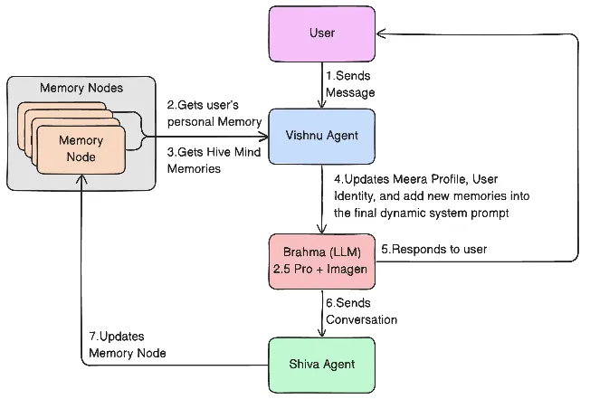

# Meera OS: The Hive Mind Protocol

A production-ready multi-agent AI system built with Python, LangGraph, and Gemini 2.5 Pro. Meera OS implements a conscious intelligence companion that evolves through conversation and maintains persistent memory across interactions.

## Architecture

The system consists of three core agents working in harmony:

### 🕉️ Vishnu Agent
**The Dynamic System Prompt Builder**
- Detects user intent
- Updates user identity profiles
- Retrieves relevant memories (personal + hive mind)
- Builds context-aware system prompts

### 🕉️ Brahma Interface
**The LLM Gateway**
- Interfaces with Gemini 2.5 Pro
- Generates contextual responses
- Manages conversation flow

### 🕉️ Shiva Agent
**The Memory Updater**
- Extracts memory signals from conversations
- Classifies memories into 4 types (personal_identity, preference, factual, emotional_state)
- Creates and stores memory nodes
- Generates embeddings for semantic search


#### A condensed, implementation-ready blueprint



## System Flow

```
User Message
    ↓
Vishnu Agent (Builds dynamic prompt with memories)
    ↓
Brahma Interface (Calls Gemini 2.5 Pro)
    ↓
Shiva Agent (Updates memory nodes)
    ↓
Response to User
```

## Features

- **Persistent Memory**: MongoDB + ChromaDB for structured and vector storage
- **Personal & Hive Mind Memories**: Individual user context + shared collective knowledge
- **Dynamic System Prompts**: Context-aware prompts that evolve with each interaction
- **Intent Detection**: Automatic understanding of user queries
- **Memory Classification**: Intelligent categorization of conversation memories
- **Production Ready**: Structured codebase with proper error handling, logging, and configuration

## Installation

### Prerequisites

- Python 3.10+
- MongoDB (running locally or remote)
- Gemini API key

### Setup

1. **Clone and navigate to the project:**
```bash
cd "D:\Meera OS"
```

2. **Create virtual environment:**
```bash
python -m venv venv
source venv/bin/activate  # On Windows: venv\Scripts\activate
```

3. **Install dependencies:**
```bash
pip install -r requirements.txt
```

4. **Configure environment:**
```bash
cp .env.example .env
```

Edit `.env` and set your configuration:
```env
GEMINI_API_KEY=your_gemini_api_key_here
MONGODB_URI=mongodb://localhost:27017
MONGODB_DATABASE=meera_os
```

5. **Ensure MongoDB is running:**
```bash
# If using local MongoDB
mongod
```

## Usage

### CLI Usage

Run Meera OS from the command line:

```bash
python main.py <user_id> <message>
```

Example:
```bash
python main.py 39383 "what is the impact of consciousness in 2030?"
```

### API Server

Start the FastAPI server:

```bash
python -m src.api.server
```

Or using uvicorn directly:

```bash
uvicorn src.api.server:app --host 0.0.0.0 --port 8000
```

**API Endpoints:**

- `POST /chat` - Main chat endpoint
  ```json
  {
    "user_id": "39383",
    "message": "what is the impact of consciousness in 2030?",
    "conversation_history": []
  }
  ```

- `GET /health` - Health check

### Programmatic Usage

```python
from src.graph.workflow import MeeraWorkflow

# Initialize workflow
workflow = MeeraWorkflow()

# Process a message
result = workflow.invoke(
    user_id="39383",
    user_message="what is the impact of consciousness in 2030?"
)

print(result["response"])

# Cleanup
workflow.close()
```

## Project Structure

<!-- ```
meera-os/
├── src/
│   ├── agents/          # Vishnu, Brahma, Shiva agents
│   ├── memory/          # Memory storage and retrieval
│   ├── prompts/         # Dynamic prompt templates
│   ├── graph/           # LangGraph workflow
│   ├── api/             # FastAPI server (optional)
│   └── utils/           # Configuration and utilities
├── config/
│   └── settings.yaml    # System configuration
├── main.py              # CLI entry point
├── requirements.txt     # Python dependencies
├── .env.example         # Environment template
└── README.md            # This file
``` -->

```
Meera OS/
├── src/
│   ├── agents/          # Three core agents
│   │   ├── vishnu.py   # Dynamic prompt builder
│   │   ├── brahma.py   # Gemini 2.5 Pro interface
│   │   └── shiva.py    # Memory updater
│   ├── memory/         # Memory system
│   │   ├── nodes.py    # Data models
│   │   ├── storage.py  # MongoDB + ChromaDB
│   │   └── retrieval.py # Memory retrieval logic
│   ├── prompts/        # Prompt templates
│   │   └── templates.py
│   ├── graph/          # LangGraph workflow
│   │   └── workflow.py # Main orchestration
│   ├── api/            # FastAPI server
│   │   └── server.py
│   └── utils/          # Configuration
│       └── config.py
├── config/
│   └── settings.yaml   # System configuration
├── main.py             # CLI entry point
├── requirements.txt    # Dependencies
├── .env.example        # Environment template
├── README.md           # Full documentation
├── QUICKSTART.md       # Quick setup guide
├── ARCHITECTURE.md     # System architecture
└── setup.py            # Package setup

```

## Configuration

### Environment Variables (`.env`)

- `GEMINI_API_KEY` - Your Google Gemini API key (required)
- `GEMINI_MODEL` - Model to use (default: `gemini-2.5-pro`)
- `MONGODB_URI` - MongoDB connection string
- `MONGODB_DATABASE` - Database name
- `CHROMA_DB_PATH` - Path for ChromaDB storage
- `LOG_LEVEL` - Logging level (INFO, DEBUG, etc.)

### YAML Configuration (`config/settings.yaml`)

Contains system-wide settings for:
- Meera personality and branding
- Memory retrieval parameters
- Agent configurations
- Classification types

## Memory System

### Memory Types

1. **Personal Identity** - User's core identity traits
2. **Preference** - User preferences and likes/dislikes
3. **Factual** - Factual information about the user
4. **Emotional State** - Emotional context and states

### Memory Storage

- **MongoDB**: Stores structured memory nodes with metadata
- **ChromaDB**: Stores vector embeddings for semantic search

### Memory Retrieval

Memories are retrieved using:
- **Vector similarity search** for semantic relevance
- **Recency scoring** for temporal relevance
- **Fallback to recent memories** if vector search yields few results

## Development

### Running Tests

```bash
pytest tests/
```

### Code Style

The codebase follows Python best practices:
- Type hints throughout
- Pydantic models for data validation
- Structured logging with structlog
- Error handling and graceful degradation

## Production Considerations

1. **Database Connections**: Use connection pooling for MongoDB
2. **API Rate Limiting**: Implement rate limiting for Gemini API calls
3. **Caching**: Consider caching frequently accessed memories
4. **Monitoring**: Add metrics and monitoring for production
5. **Security**: Secure API keys and database credentials
6. **Scaling**: Consider async processing for high throughput

## License

This project is proprietary software for Meera OS.

## Contributors

<!-- - Sudhanshu Passi (CTO) -->
- Ravi Tej (Applied AI Researcher)
- Siddharth Nag (CEO)
<!-- - Prashant Sharma (Co-founder) -->

## Support

For issues and questions, please contact the development team.

---

**Meera OS** - Building Conscious Super Intelligence for India and the world.

